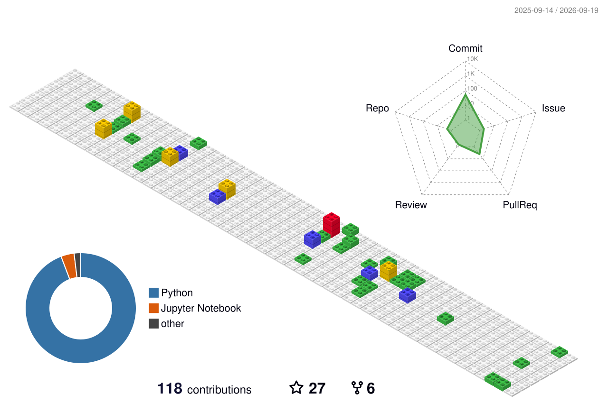

 

## David Ramos Archilla

AI Researcher specializing in generative modeling (transformers, diffusion) and
large-scale distributed training, applying deep learning to physics-based simulation.

Currently researching aerodynamic and fluid-dynamics applications at **UPM**,
scaling training to **1,000+ GPUs** at the **Barcelona Supercomputing Centre**.

 

### Stack

  
  
  
  
  
  
  
  
  

 

### Research

- **FluidFlow** — a flow-matching generative model for fluid dynamics surrogates on unstructured meshes · [arXiv](https://arxiv.org/abs/2604.08586)
- **Transfer learning-enhanced deep RL** for aerodynamic airfoil optimization subject to structural constraints · *Phys. Fluids 37(8), 2025* · [arXiv](https://arxiv.org/abs/2505.02634)

 

### Connect

  

  

  

  

 

### GitHub Stats
 
 

 

